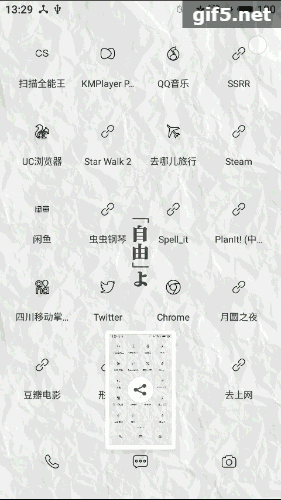
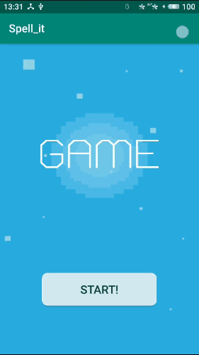

## spell_it
This is a simple game developed by AS & Java.

You need to tap the charecter to spell the name of different things. And you need 10 scores to win the game, each word provides 1 score. If time runs out, you lose. You have 8 seconds to spell a word. After the 5th pic, the difficulty will increase, there will be some complex pics (at least to me XD).

The gif below shows how you win the game:

And how you lose:

You can tap the red "×" to erase the text. If you spell something right, you will meet the next pic.

Thanks Dr.Feno and assistant teacher for the help.

Have fun :)

